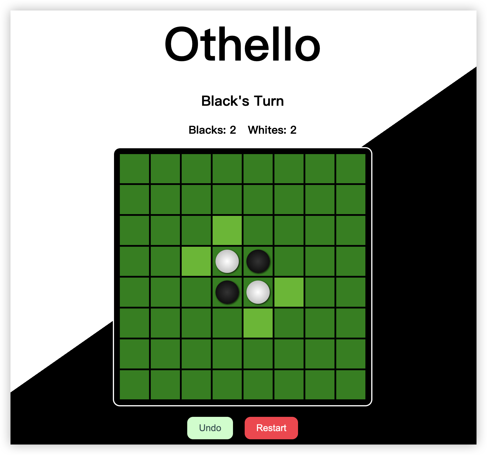

# Othello JS
Othello made with React JS

Webpage design is copied from:
https://github.com/christopherbowers/Othello-JS



## Play the Game

[Play the Game Online](https://othello.cfapps.ap21.hana.ondemand.com/)

## Getting Started as a Developer

### Prerequisites

* Node.js v20+
* npm v10.5.0+
* Git

### Clone the Repository

```shell
git clone https://github.com/guogin/othello-js.git
cd othello-js
npm install
```

### Start in Development Mode

```shell
npm start
```

Runs the app in the development mode.\
Open [http://localhost:3000](http://localhost:3000) to view it in your browser.

The page will reload when you make changes.\
You may also see any lint errors in the console.

### Build for Deployment

```shell
npm run build
```

Builds the app for production to the `build` folder.\
It correctly bundles React in production mode and optimizes the build for the best performance.

The build is minified and the filenames include the hashes.\
Your app is ready to be deployed!

See the section about [deployment](https://facebook.github.io/create-react-app/docs/deployment) for more information.

### Other Available Scripts by React

In the project directory, you can run:

#### `npm test`

Launches the test runner in the interactive watch mode.\
See the section about [running tests](https://facebook.github.io/create-react-app/docs/running-tests) for more information.
